# Music_world

## Link

- https://github.com/Daniel84Ting/Music_world

## Database/Storage

- #### PostgresSQL

## Technologies

- Django
- Django-filter
- Djangorestframework
- Pillow 
- Psycopg2-binary
- Markdown
 

## RESTful router

| **No.** | **Route** | **URL**    | **HTTP Verb** | **Description** |
| ------- | --------- | ---------- | ------------- | --------------- |
| 1.      | Read      | / event    | GET           | Read Event      |
|         |           | / post     | GET           | Read Post       |
|         |           | / review   | GET           | Read Reviews    |
|         |           | / comment  | GET           | Read Comments   |
|         |           | / register | GET           |                 |
| 2.      | Create    | / event    | POST          | Create Event    |
|         |           | / post     | POST          | Create Post     |
|         |           | / review   | POST          | Create Reviews  |
|         |           | / comment  | POST          | Create Comments |
|         |           | / register | POST          | Register form   |
|         |           | / login    | POST          | Login form      |
| 3.      | Update    | / event    | PUT           | Edit Event      |
|         |           | / post     | PUT           | Edit Post       |
|         |           | / register | PUT           |                 |
| 4.      | Destroy   | / Event    | DELETE        | Delete Event    |
|         |           | / post     | DELETE        | Delete Post     |
|         |           | / register | DELETE        | Logout form     |
|         |           | / login    | DELETE        | Logout form     |

## Accomplishments

- This app is to create a plaform for all the music players to share and play music together. User need to register and login to the app. User need to update they profile and picture. user can create the event with instrument category for those music player who able to play a specific instruments require. User can click on the other user post to view all the information of the coming event. User also can give the review after join the event. User can edit or delete they own event if any changes for they event. For organiser (admin) can create the event or any sponsor advertisment for all the musician to join the event, and also can edit or delete the event if any changes for the event. Organiser can create the music Instrument category for the musician to choose the instrument category for the user post event requirement. Organiser can delete the musician post event if any vilation of policy issue. 

## Wireframe Design

#### Authentication

- Click on Register to register. after register click on Login to login tp main page.
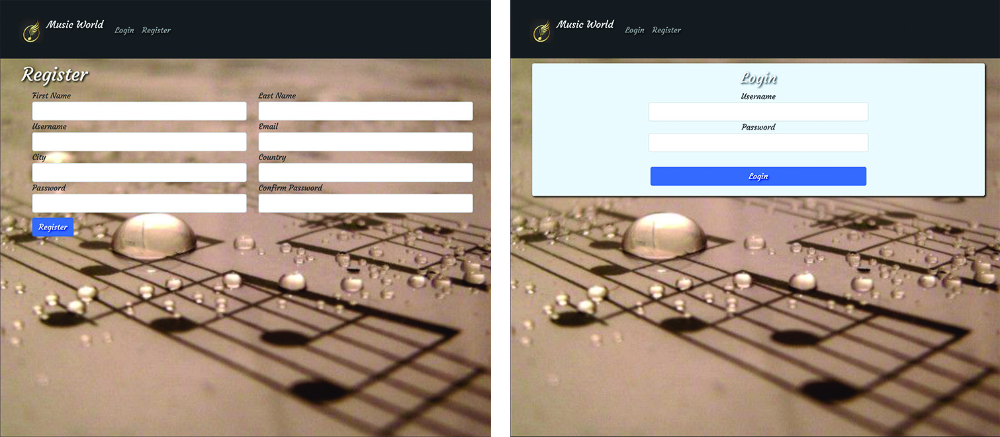

#### User Views

- Profile page for user to view the information and update the profile and profile picture.

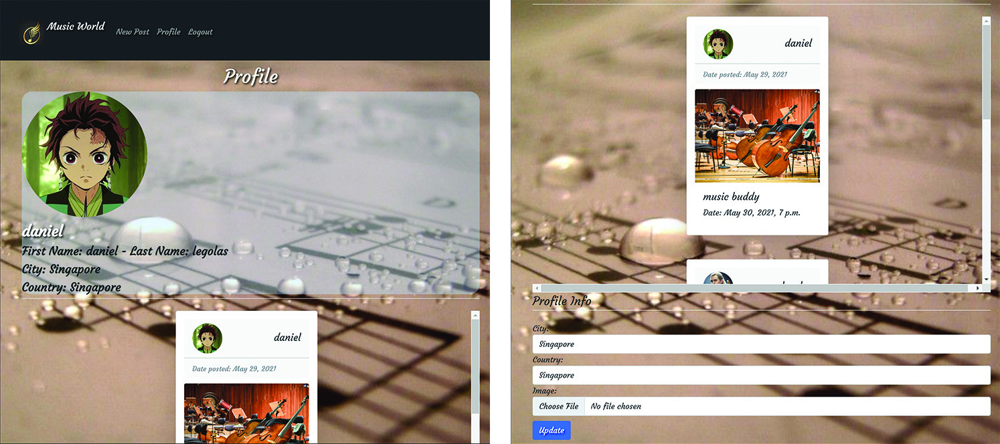

- Main page for user to view all the event posted by other user and the organiser. the navigation only will show the Music world, New post, profile and Logout button.

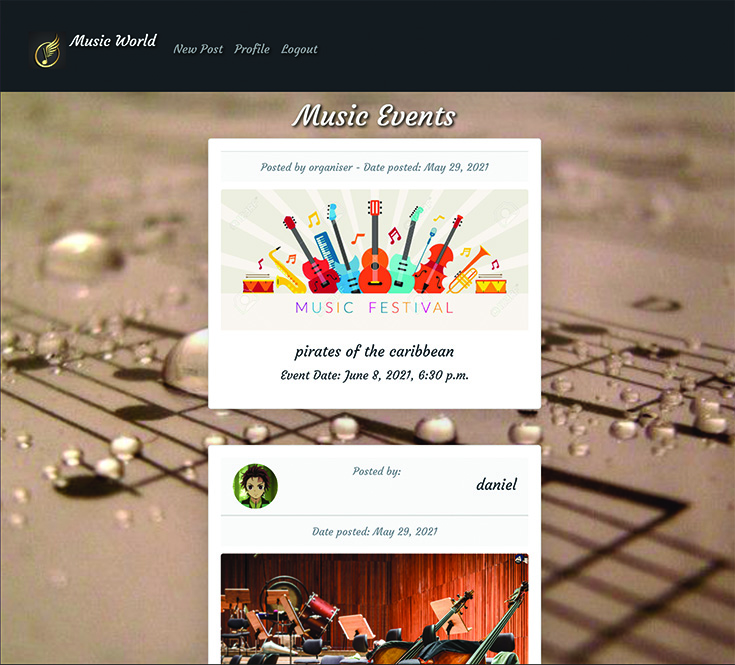

- User post page for user create new events or searching new hobby music player to play music instrument together.

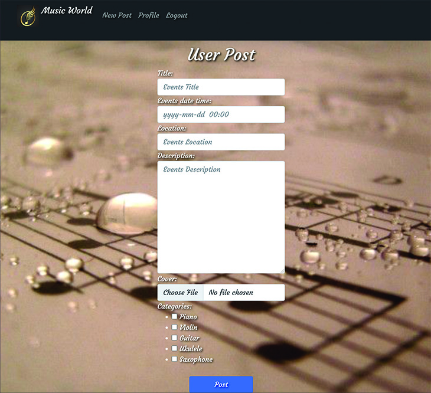

- User post show page to view more information about the event and also can give the review about the event.

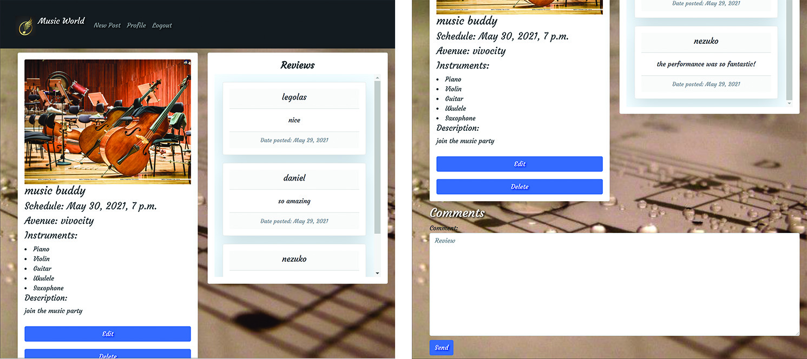

- User can edit or delete post if any changes.

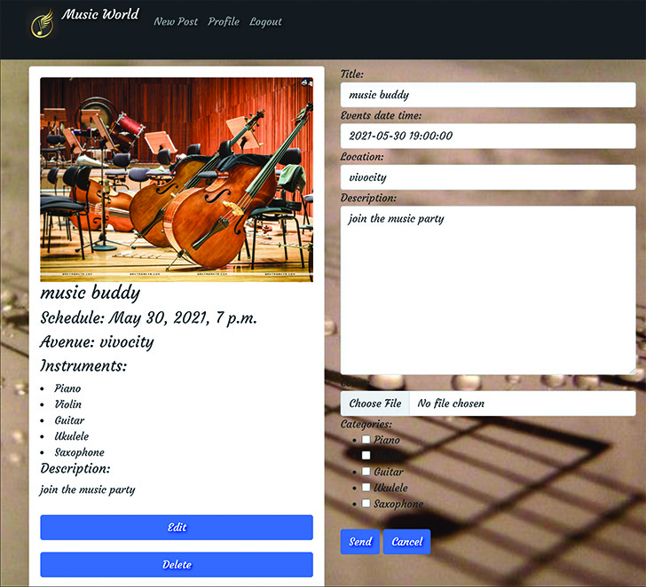

- User can view the event information posted by organiser, and also can give the review about the event.

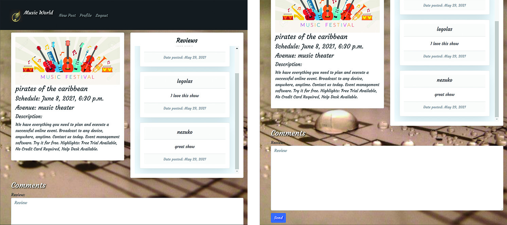

#### Admin Views

- Admin main Page for organiser to view all the event, and the navigation only will show Music world, Category, Events, User posted, logout button.

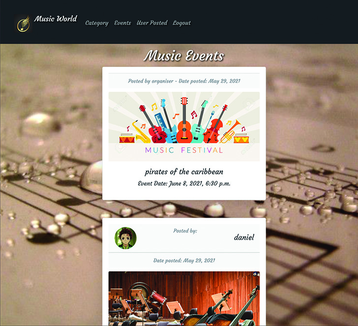

- Admin event post Page to create the event or the advertisment to invite all the musician.

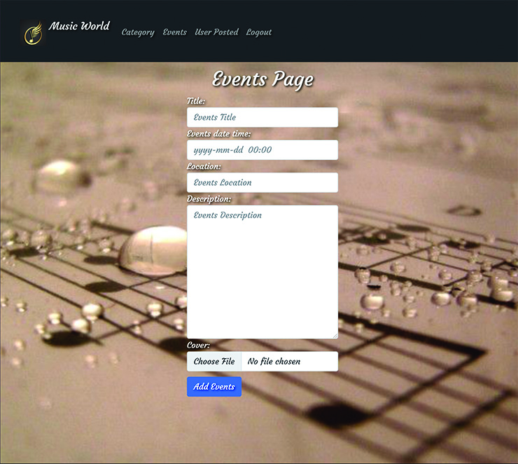

- Admin category Page to create the instrument category for user to post event. 

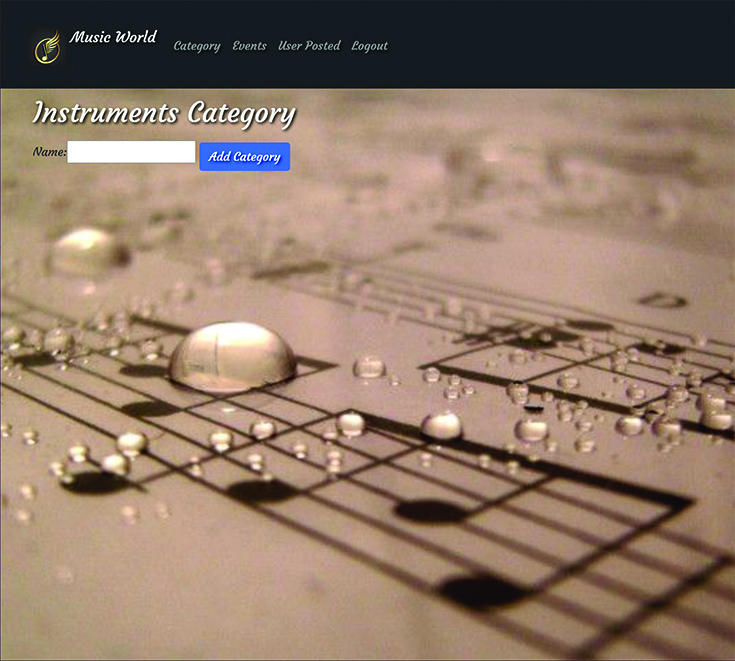

- Admin event show Page to view the organiser own page event infromation.

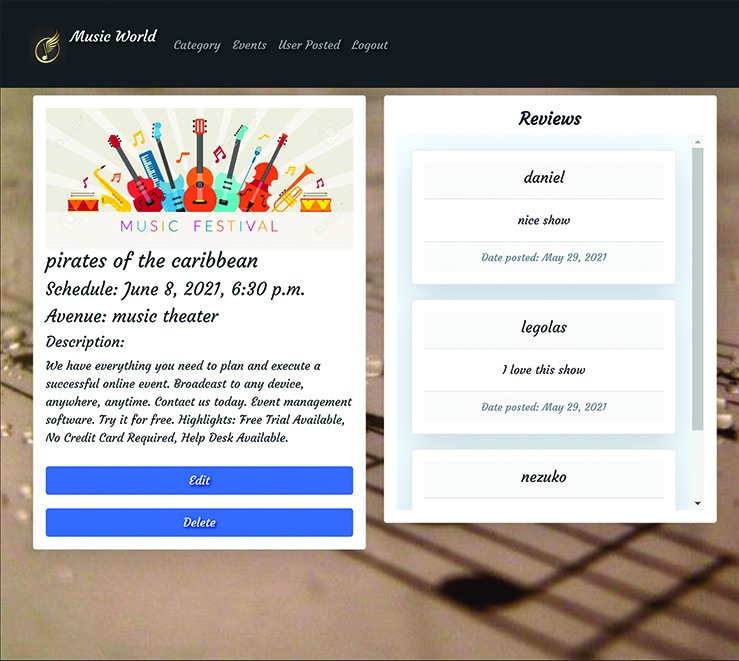

- Admin event edit Page for organiser to edit or delete the event if any changes.

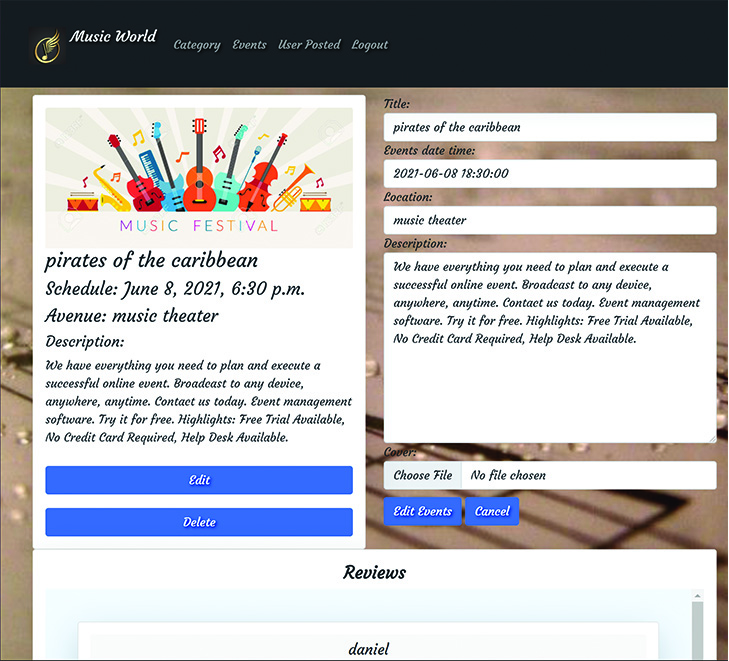

- Admin user post Page for organiser to view all user post the events.

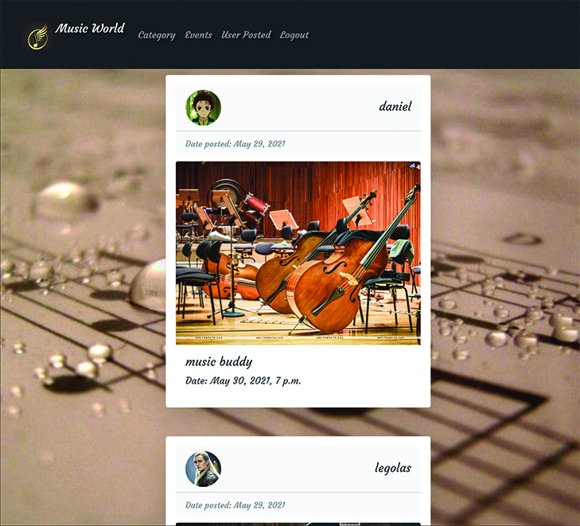

- Admin user post show Page to view the user post information. and if the user vilation of policy issue will delete the user post.

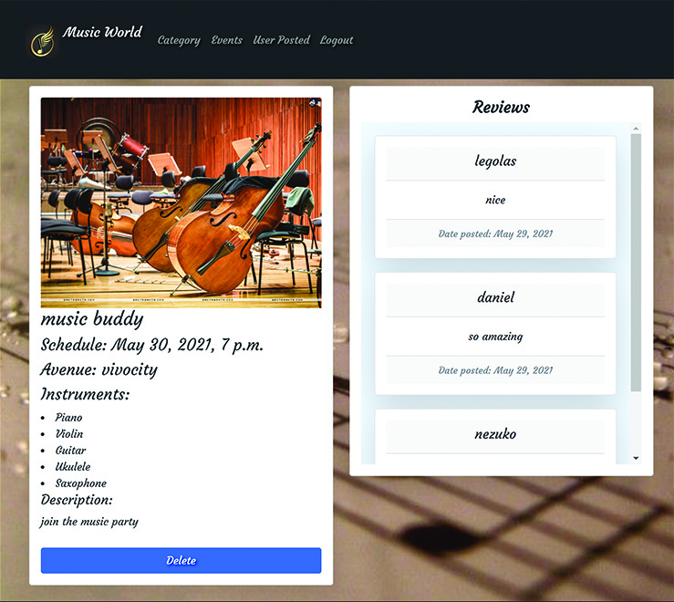

## Additional Features were under Considerations

- search catogory for the event post. 
- profile page that only show user own posted event.
- user can view other user profile page information.
- user can leave the message for other user to contact if interested on the event.